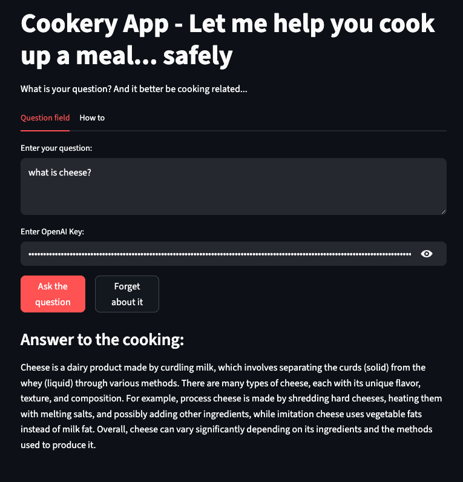

# Chef’s AI Assistant – LLM Zoomcamp Project  

Welcome to my **LLM Zoomcamp Project**!  
In this repository, we’ll build an AI Assistant designed to help *chefs in training* navigate the complex knowledgebase of cooking.  

Using techniques like **Retrieval-Augmented Generation (RAG)** and **hybrid search**, we’ll see how an LLM can be grounded in a structured knowledge base to provide trustworthy, context-driven answers.  

---

## Project Motivation  

Cooking is full of concepts, techniques, and rules that beginners can find overwhelming:  

- *What does blanching mean?*  
- *How do you sauté vegetables properly?*  
- *What’s the difference between roasting and baking?*  
- *What can I use instead of buttermilk?*  

Instead of sifting through articles or multiple recipe blogs, this assistant provides **fast, accurate, and context-grounded answers** directly from a curated cooking knowledgebase.  



---

## Dataset  

We’ll use the dataset **Cooking Knowledge Basics** from Kaggle:  
[Cooking Knowledge Basics Dataset](https://www.kaggle.com/datasets/tiyabk/cooking-knowledge-basics)  

**Format:** CSV with three key columns  
- `type` – category of knowledge
- `question` – student-style cooking question  
- `response` – reference answer  

This makes it perfect for a **knowledge-augmented Q&A assistant**.  

---

Sources

### Setup

Run Notebook
```bash
jupyter notebook
```

## Code
- core.ipynb - the primary notebook interface
- rag_eval.ipynb - notebook containing RAG evaluation logic
- minsearch.py - in-memory search engine
- ingest.py - cut down version of core.ipynb use for data ingestion
- app.py - cut down version of core.ipynb for LLM logic

### Ingestion

The ingestion script is located in core.ipynb with a copy of it in ingest.py

With the use of minsearch the knowledge base ingestion script should be run during startup.

### Experiments

For experiments, please use the jupyter notebook core.ipynb and rag_eval.ipynb

### Retrieval evaluation

With a basic approach - using minsearch without boosting:
- Hit rate 83.6%
- MRR 64%

With a bit of boosting:
- Hit rate 85.6%
- MRR 66.4%

With the boosting parameter
```json
    boost = {
            'id': 2.7692628744506598,
            'question': 0.3243327894022373,
            'response': 0.5744326020937277
            }
```

### RAG flow evaluation

LLM-as-a-judge was used to evaluate the quality of the RAG flow.

For the default gpt-4o-mini in a sample of 100 records:
- 85% RELEVANT
- 11% PARTLY_RELEVANT
- 4% NON_RELEVANT

The use of gpt-4o was also used:
- 85% RELEVANT
- 12% PARTLY_RELEVANT
- 3% NON_RELEVANT
